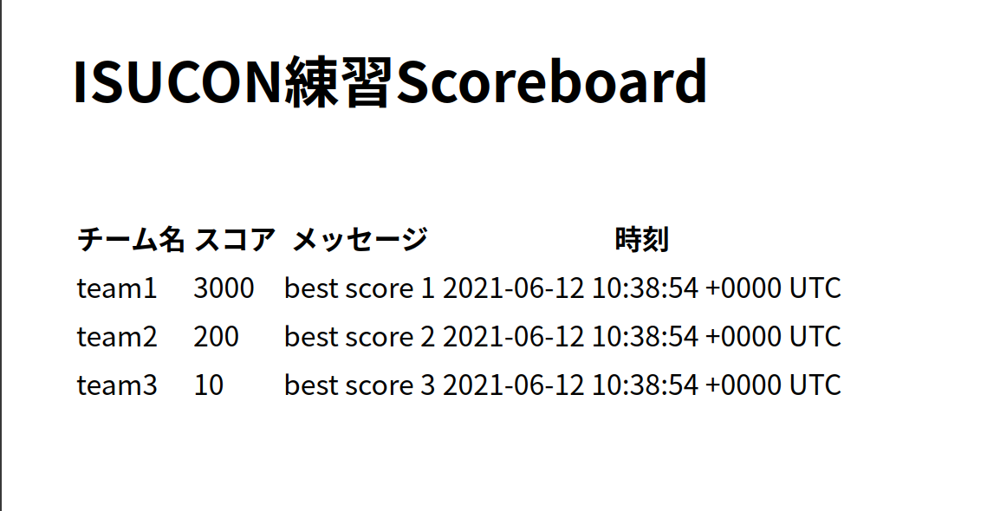

# (未完成) isucon-suburi-portal
ISUCONの練習のためのポータルサイト



```text
# GET /
スコアログが表形式で表示される
# POST /bench
未実装。ベンチを回すときに投げる。固定文字列による簡易認証にする予定
# POST /report
lambdaからbenchの結果を投げる先。benchの結果にteam名を付与してPOSTする。これも固定文字列による簡易認証
# GET /log.json
GET /ではテーブルの形なので、json形式で返すエンドポイントを用意。中身は GET / と同じ
```

# curl(for dev)
- add score_log
```
curl -v localhost:8080/report -H "ReportToken:report_token_example" -H "Content-Type:application/json" -d '{"team_name": "won_the_first_prize", "score": 100000, "message": "best score!"}'
```
